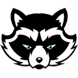

# Tiny Bandit



Inspired by the prior [Tiny TV](https://github.com/eat-sleep-code/tiny-tv) project, we are back with Tiny Bandit.  Tiny Bandit is a miniaturized version of a casino gaming machine that can support multiple simple games.  

The initial games that will be included are Slots and FlappyBird.<sup>[1](#footnote01)</sup>     

---

## Game Development

Interested in adding your own simple game to this project?   If so, here are a few guidelines.

- Your game must be written in Python 3 and utilize the current PyGame library
- Your game must run in a self-contained sub folder
- Your game must expose a base class called `Game`
- Your game must expect no more than two external button inputs

---

## Installation

Installation of the program, any software prerequisites, as well as the display driver can be completed with the following two-line install script.

```
wget -q https://raw.githubusercontent.com/eat-sleep-code/tiny-bandit/main/install-tiny-bandit.sh -O ~/install-tiny-bandit.sh
sudo chmod +x ~/install-tiny-bandit.sh && ~/install-tiny-bandit.sh
```

---


## Autostart at Desktop Login

To autostart the program as soon as the Raspberry Pi OS desktop starts, execute the following command:

```
sudo nano /etc/xdg/lxsession/LXDE-pi/autostart
```

Add the following line to the end of the file and then save the file:

```
@lxterminal --geometry=1x1 -e sudo python3 /home/pi/tiny-bandit/tiny-bandit.py
```

---

## To-Do List:

- [X] Display current coins (and freeplays?)
- [X] Add or deduct coins (and freeplays?)
- [X] Add jackpot image 
- [X] Add wild image 
- [X] Add actual mask
- [X] Add splash screen / menu
- [X] Write install script
- [X] Add Sounds for FlappyBird
- [ ] Build physical Tiny Bandit machine and document the process
- [ ] Add web service integration to allow date-specific promotions and possible Leaderboard

---
## Credits

FlappyBird was originally created by [Dong Nguyen](https://dotgears.com).  The instance included in this repository uses unique code, but does repurpose some of the original game's imagery.